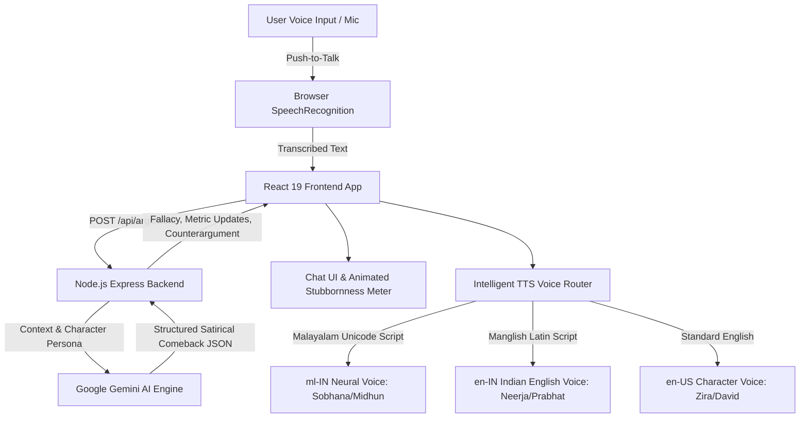

# URULAKKUPPERI (ഉരുളക്കുപ്പേരി) 🎯


## Basic Details
### Team Name:pointless


### Team Members

- Member 1: Talarin Miranda- SNMIMT Maliankara
- Member 2: Sayoojya K.S-SNMIMT Maliankara

### Project Description
URULAKKUPPERI is a satirical Kerala debate comedy web application where users can state any opinion, only to be relentlessly contradicted by stubborn Malayali AI archetypes (Ammachi, WhatsApp Uncle, Judgemental Aunty, Bangalore Tech Bro, and Cynical Cinema Critic). It features real-time browser voice input (Speech-to-Text) and natural Malayalam/Manglish speech synthesis (TTS), wrapped in a vibrant retro Kerala tea-shop comic aesthetic.

### The Problem (that doesn't exist)
People in real life, family gatherings, and WhatsApp groups actually expect rational, calm, open-minded debates where the other person listens to facts, admits mistakes, and gracefully concedes that you have a point.

### The Solution (that nobody asked for)
URULAKKUPPERI: An AI argument simulator that guarantees 100% contrarian defiance. No matter how universally accepted your point is (e.g. *"Water is wet"*, *"The sun rises in the east"*), the AI refuses to agree, moves the goalposts, cites unverified WhatsApp University forwards, and claps back with punchy, sarcastic 1-2 sentence comebacks in conversational Malayalam and Manglish spoken aloud with authentic Kerala pronunciation.

## Technical Details
### Technologies/Components Used
For Software:
- Languages: TypeScript, JavaScript, HTML5, CSS3
- Frameworks: React 19, Vite, Express.js
- Libraries: `@google/genai` (Google Gemini API), Lucide React, Canvas Confetti, Tailwind CSS
- Tools: Web Speech API (`SpeechRecognition` for voice input, `SpeechSynthesis` for Malayalam/Manglish TTS), PostCSS

For Hardware:
- *N/A (Pure Software Web Application)*

### Implementation
For Software:
# Installation
```bash
# Clone repository
git clone https://github.com/margreattalarin-cpu/useless_project_temp.git
cd useless_project_temp

# Install dependencies
npm install
```

# Run
```bash
# Set up environment variables (.env)
cp .env.example .env
# Add your GEMINI_API_KEY in .env

# Start both backend server (port 3001) and Vite client (port 5173)
npm run dev
```

### Project Documentation
For Software:

# Screenshots (Add at least 3)

*Hero Landing Page: Hand-painted Kerala comedy poster typography ("URULAKKUPPERI" / "ഉരുളക്കുപ്പേരി"), character selection cards, and debate controls.*


*Live Argument Arena: WhatsApp-style casual debate screen with dynamic stubbornness meter (88%), confidence tracker, and real-time fallacy tagging ("Unverified UNESCO Forward").*


*Speech Interaction: Push-to-talk voice recognition (STT) with audio level waves and natural Malayalam/Manglish speech output (TTS).*

# Diagrams



*Architecture & Data Workflow: End-to-end flow from browser push-to-talk speech input to Gemini contrarian logic and script-aware TTS speech output.*

For Hardware:

# Schematic & Circuit
*N/A (Software Project)*

# Build Photos
*N/A (Software Project)*

### Project Demo
# Video
[Add your demo video link here]
*Demonstrates starting a debate, voice recognition, real-time Gemini contrarian comebacks, and Malayalam speech synthesis.*

# Additional Demos
- Web Application: `http://localhost:5173`
- Backend API Status: `http://localhost:3001/api/health`
- Character Catalog API: `http://localhost:3001/api/characters`

## Team Contributions
- [Team Lead Name]: [Full-stack architecture, Gemini AI integration, Malayalam/Manglish TTS engine, UI styling]
- [Member 2 Name]: [Voice input implementation, character prompts design, testing]
- [Member 3 Name]: [Documentation, asset design, audio effects]

---
Made with ❤️ at TinkerHub Useless Projects 


