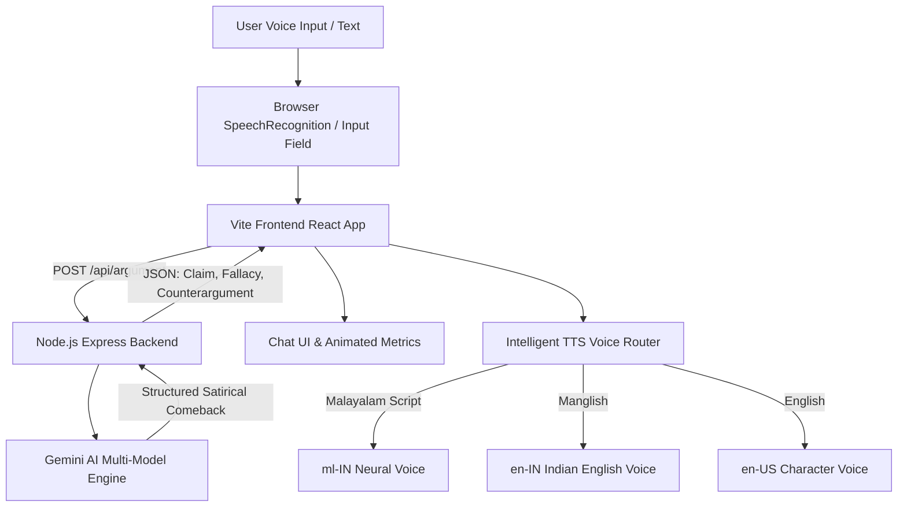

# URULAKKUPPERI (ഉരുളക്കുപ്പേരി) 🎯


## Basic Details
### Team Name: [Team Name]


### Team Members
- Team Lead: [Name] - [College]
- Member 2: [Name] - [College]
- Member 3: [Name] - [College]

### Project Description
URULAKKUPPERI is a satirical Kerala debate comedy web application where users can state any opinion, only to be relentlessly contradicted by stubborn Malayali AI archetypes. It features real-time voice input (Speech-to-Text) and natural Malayalam/Manglish speech synthesis (TTS) wrapped in a vibrant, retro Kerala tea-shop comic aesthetic.

### The Problem (that doesn't exist)
People in real life and Kerala family WhatsApp groups actually expect rational, calm, open-minded debates where the other person listens to reason, concedes mistakes, and changes their mind.

### The Solution (that nobody asked for)
An AI argument simulator that guarantees 100% contrarian defiance. No matter how logical your point is, the AI will reject your premise, move the goalposts, cite unverified WhatsApp University forwards, and clap back with punchy 1-2 sentence Malayalam or Manglish comebacks spoken aloud with authentic Kerala pronunciation.

## Technical Details
### Technologies/Components Used
For Software:
- Languages: TypeScript, JavaScript, HTML5, CSS3
- Frameworks: React 19, Vite, Express.js
- Libraries: `@google/genai` (Google Gemini API), Lucide React, Canvas Confetti, Tailwind CSS
- Tools: Web Speech API (`SpeechRecognition` & `SpeechSynthesis`), PostCSS

For Hardware:
- *N/A (Pure Software Web Application)*

### Implementation
For Software:
# Installation
```bash
git clone https://github.com/margreattalarin-cpu/useless_project_temp.git
cd useless_project_temp
npm install
```

# Run
```bash
# Start backend server and Vite client concurrently
npm run dev
```

### Project Documentation
For Software:

# Screenshots (Add at least 3)

*Hero Landing Page: Hand-painted Kerala comedy poster typography, character selection, and audio controls.*


*Live Argument Arena: WhatsApp-style casual debate, dynamic stubbornness tracking, and humorous fallacy tagging.*


*Speech Interaction: Push-to-talk voice input (STT) and natural Malayalam/Manglish speech synthesis (TTS).*

# Diagrams

*Architecture & Data Workflow: From user speech input to Gemini contrarian logic, culminating in intelligent script-aware TTS synthesis.*

For Hardware:

# Schematic & Circuit
*N/A (Software Project)*

# Build Photos
*N/A (Software Project)*

### Project Demo
# Video
[Add your demo video link here]
*Demonstrates starting a debate, voice recognition, real-time Gemini contrarian comebacks, and Malayalam speech synthesis.*

# Additional Demos
- Web Application Local Preview: `http://localhost:5173`
- Backend Health Endpoint: `http://localhost:3001/api/health`

## Team Contributions
- [Team Lead Name]: [Full-stack architecture, Gemini AI integration, Malayalam/Manglish TTS engine, UI styling]
- [Member 2 Name]: [Voice input implementation, character prompts design, testing]
- [Member 3 Name]: [Documentation, asset design, audio effects]

---
Made with ❤️ at TinkerHub Useless Projects 


